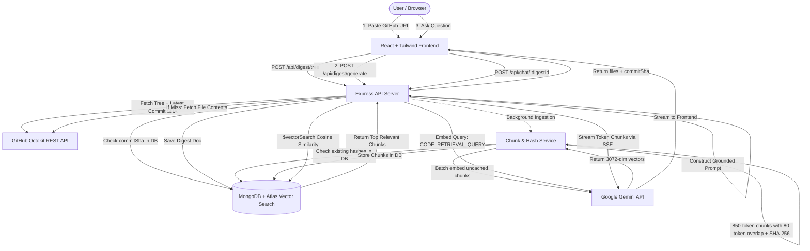

# RepoDigest — Technical Architecture & Interview Preparation Guide

This guide breaks down the core engineering decisions, architecture, and technical trade-offs of **RepoDigest**. Use this as your cheat sheet when presenting and defending this project in engineering interviews.

---

## 1. The 30-Second Elevator Pitch

> *"RepoDigest is a full-stack developer tool that converts any GitHub repository into an LLM-ready context digest and indexes its codebase for semantic AI search using a custom RAG (Retrieval-Augmented Generation) pipeline. It utilizes **Google Gemini** for true multi-text batch embeddings, **MongoDB Atlas Vector Search** for similarity retrieval, and **Server-Sent Events (SSE)** for real-time answer streaming. To optimize API costs and rate limits, I implemented Git Commit SHA caching, SHA-256 chunk deduplication, and zero-dependency sliding-window rate limiting."*

---

## 2. End-to-End Architecture & Data Flow

---

## 3. Key Technical Decisions & Why You Made Them

### Q1: Why build a RAG pipeline instead of dumping the entire repository into Gemini's 1M+ token window?
* **Cost & Token Burn**: Dumping a 300,000-token repository into every chat message costs significantly more money and quickly exhausts API quotas.
* **Latency**: Processing massive context windows creates high Time-To-First-Token (TTFT) latency.
* **"Lost in the Middle" Degradation**: Even large-context LLMs suffer accuracy degradation when critical details are buried in the middle of hundreds of thousands of irrelevant tokens. RAG narrows the context down to the exact relevant functions and modules.

---

### Q2: Why MongoDB Atlas Vector Search instead of Pinecone, Chroma, or Weaviate?
* **Single Source of Truth**: Instead of syncing repository metadata, user data, digests, and vector embeddings across two separate databases, everything lives in one database.
* **Transactional Consistency & No Sync Lag**: When a digest is updated or deleted, chunk vectors are cleaned up in the same database without orphan records or dual-database sync lag.
* **Operational Simplicity**: Avoids extra cloud subscriptions, API keys, and vendor overhead.

---

### Q3: How did you solve API rate limits and speed up embedding ingestion?
1. **True Batch Embeddings (`@google/genai`)**:
   * *Before*: The app was sending 1 HTTP request per chunk. A 300-chunk repository made 300 individual API calls, taking 10–15 minutes and hitting 429 quota limits.
   * *After*: We bundle up to **25 chunks per API call** using `contents: string[]` with `taskType: 'RETRIEVAL_DOCUMENT'`. 300 chunks now take only **12 requests** and finish in **~3–8 seconds**.
2. **Smart Token Boundaries**:
   * Tuned chunk size to **850 tokens** with **80-token overlap**, reducing total chunk count by ~40% while preserving entire functions and classes.
3. **SHA-256 Chunk Deduplication**:
   * Each chunk has a deterministic `chunkHash = sha256(filePath + text)`. If a file hasn't changed between commits or indexing runs, its vector is pulled directly from MongoDB without touching Gemini (0 API calls).

---

### Q4: Why use Server-Sent Events (SSE) instead of WebSockets for Chat?
* **Unidirectional Stream**: Chat responses are single-direction streaming (Server $\rightarrow$ Client). WebSockets introduce full-duplex overhead and connection state management that is unnecessary for simple text streaming.
* **HTTP/2 Compatible & Firewall Friendly**: SSE works over standard HTTP without custom protocol upgrades or proxy routing issues.
* **Built-in Browser Support**: Works natively via `fetch()` and `ReadableStreamDefaultReader` or `EventSource`.

---

### Q5: How does your caching strategy work?
* **Git Commit SHA Caching**: Instead of an arbitrary 1-hour time expiration (which serves stale code if someone commits, or re-fetches unchanged code after 60 minutes), we match the repository's exact **Git commit SHA**.
* **Zero Overhead**: If the commit SHA matches a cached record in MongoDB, the digest and vector index are served instantly with 0 GitHub API calls and 0 Gemini calls.

---

## 4. Top 10 Interview Questions & Answers

### 1. "How do you prevent hallucinations in the AI's responses?"
> *"I use a strict grounding system prompt that instructs the model to answer ONLY using the provided code context and to state 'I couldn't find relevant code for that question in the indexed files' if the context does not contain the answer. Furthermore, I pass the file paths and line numbers in the context headers so the model can cite exact sources."*

### 2. "Why do you need chunk overlap?"
> *"If a critical function or class definition happens to get split across the boundary of Chunk A and Chunk B, a single chunk might only contain half the logic, hurting semantic similarity during vector search. Overlapping lines (e.g., 80 tokens) ensures that boundary code exists in both adjacent chunks."*

### 3. "What happens if a user submits a massive repository with 10,000 files?"
> *"The backend enforces a `MAX_CHUNKS = 500` limit for AI indexing. If a repository exceeds this threshold, the ingest status is flagged as `too_large`, preventing runaway API bills, and the user is prompted to download the full text digest directly."*

### 4. "How do you protect your backend from DDoS or API quota abuse?"
> *"I implemented a zero-dependency in-memory sliding-window rate limiter in `middleware/rateLimiter.js`. It restricts digest generation to 20 requests per 15 minutes and chat questions to 40 per minute per IP, responding with standard `RateLimit-*` and `Retry-After` headers."*

### 5. "Why do you use different task types for embedding documents vs questions?"
> *"Google Gemini's embedding model (`gemini-embedding-001`) utilizes Matryoshka Representation Learning (MRL). Specifying `taskType: 'RETRIEVAL_DOCUMENT'` for indexed code and `taskType: 'CODE_RETRIEVAL_QUERY'` for user questions optimizes the vector space for asymmetric retrieval, giving significantly higher cosine similarity for relevant code."*

### 6. "How does the backend handle long-running background ingestion?"
> *"Digest creation saves a document with `ingestStatus: 'pending'`, returns the response to the user immediately, and starts `chunkAndEmbed` asynchronously. The frontend polls `/api/digest/:id/status` until the status transitions to `ready`, allowing users to explore the digest while indexing completes."*

### 7. "How do you handle client aborts during streaming?"
> *"The frontend uses the `ReadableStream` reader which cancels the stream on component unmount or error. On the backend, we flush headers and stream chunks as they arrive from Gemini's `generateContentStream`."*

### 8. "Why do you estimate tokens by `text.length / 4` instead of a heavy tokenizer library?"
> *"In JavaScript/Node.js, full BPE tokenizers like `tiktoken` add significant CPU overhead and package bloat. For chunk boundary approximation, character-length estimation ($\sim 4$ characters per token) is within 5–10% accuracy and runs in $O(1)$ time."*

### 9. "What are the indexing rules for your MongoDB vector collection?"
> *"We create an Atlas Search `$vectorSearch` index named `vector_index` on the `embedding` field (3072 dimensions, cosine similarity metric) with `owner`, `repo`, and `ref` as filter fields. This allows vector search to restrict candidate search pools directly at the database level."*

### 10. "If you had another month to work on this, what would you add next?"
> *"1. **AST-based code chunking** using Tree-sitter to split along exact function and class AST nodes rather than line counts.*
> *2. **Hybrid Search (BM25 + Vector Search)** via Reciprocal Rank Fusion (RRF) to combine exact symbol search (e.g. `function parseGithubUrl`) with semantic conceptual search."*

---

## 5. Technology Stack Summary

| Layer | Technologies |
| :--- | :--- |
| **Frontend** | React 19, Vite, Tailwind CSS v4, Lucide Icons, Shadcn UI |
| **Backend** | Node.js (ES Modules), Express 5 |
| **Database** | MongoDB Atlas (Mongoose + Atlas Vector Search) |
| **AI / LLM** | Google Gemini API (`@google/genai`, `gemini-2.5-flash`, `gemini-embedding-001`) |
| **Third-Party APIs**| GitHub REST API (`@octokit/rest`) |
| **Streaming** | Server-Sent Events (SSE / `text/event-stream`) |
